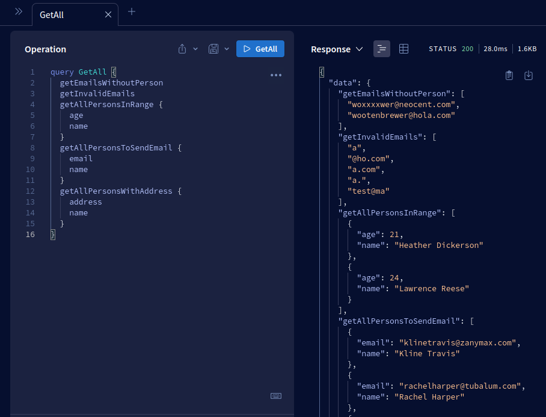
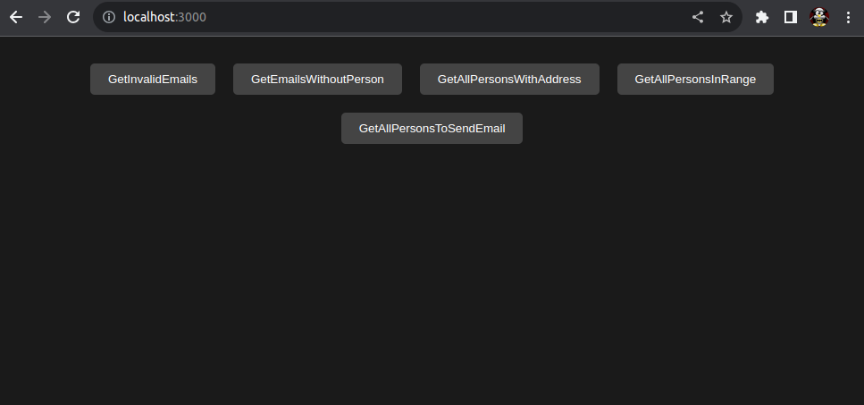
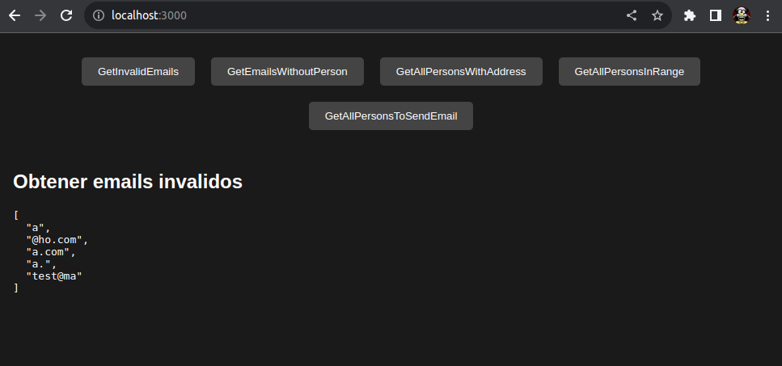
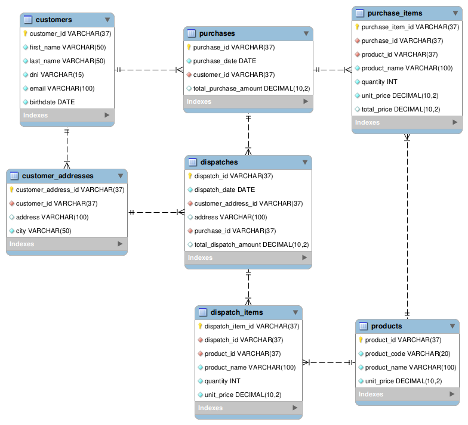

# Reto Lógico

<p align="center">
  <a href="http://nestjs.com/" target="blank"></a>
</p>

## Description
<p>
  Application developed with Nest and GraphQL
</p>


## GraphQL queries
  Queries documented using Apollo Plugin, show in ```http://{application_url}/graphql``` for example ```http://localhost:3000/graphql```



## Running the app
1. Clone the project

2. Install dependencies
```bash
$ npm install
```
4. Run the app

```bash
# development
$ npm run start

# watch mode
$ npm run start:dev

# production mode
$ npm run start:prod
```

## Using the app
1. Go to ```http://{application_url}``` for example ```http://localhost:3000```

2. Wait for the page to render



3. Test all queries using the buttons



## Test
<p>
  Only the backend has unit test

```bash
# unit tests
$ npm run test
```
</p>

***

# Entity-Relationship Model
<p>
  The image details all the requirements.
</p>


